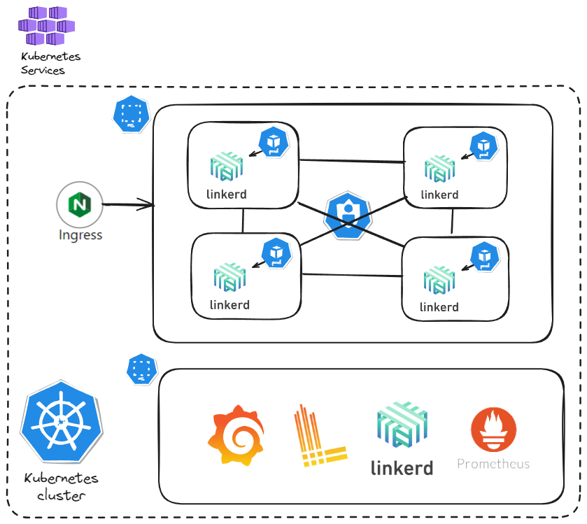

# TEST DEVOPS IT

## Prerrequisitos
- AKS

## Creando un clúster de AKS

En esta caso, empecé aprovisionando la infraestructura necesaria para los ejercicios solicitados, un AKS y un ACR.
Si no tienes un cluster de AKS, puedes aprovisionarlo con los siguientes comandos desde la ruta /terraform.
```sh
terraform init -upgrade
terraform plan
terraform apply
```
Y obtener la configuración del archivo kubectl con el siguiente comando.
```sh
echo "$(terraform output kube_config)" > ./azurek8s
```
Nota: Si viera << EOT al principio y EOT al final, quite estos caracteres del archivo. 

Con esto, ya tendríamos nuestra infraestructura montada, para empezar a probar, lo siguente es negenerar un Pipeline, en Azure DevOPs.

## Pipeline Azure DevOps

Lo primero, es tener configurado un pool de agentes, en este caso utilice mi propia maquina local, en caso de no tener una configuración Default
con una maquina ubuntu, siéntase libre de cambiarlo por una de este sistema y que tenga Python 3.10.12 para poder ejecutar el Pipeline correctamente.
Solo debe modificar: 
```sh
pool:
  name: Default
```
por el pool que desee, por ejemplo:
```sh
pool:
  vmImage: 'ubuntu-latest'
```
También es necesario que configure el servicio de conexión al ACR.
En Pipeline solo tiene dos pasos, uno ejecuta solamente las pruebas unitarios y el siguiente construye la imagen necesaria para implementarla en AKS.
Las variables que necesita configurar en el pipeline son:
|  1 |  2 |
|--------------|--------------|
| dockerRegistryServiceConnection | Es el nombre que tiene la conexión que se configura en Azure DevOps para el ACR |

## Implementar la aplicación

En este paso, se debe configurar las variables que tiene el script, se ejecuta con bash ./deploy.sh  , con esto se obtendran los valores necesarios para
que se cree el rol correspondiente para que AKS pueda obtener la imagen, tambien se debe tener en cuenta el nombre del ACR y el tag que quiere implementar.
Puede validar que datos necesita el archivo y modificarlo, a continuación modifique el nombre del acr en el archivo de order-service-deployment junto con el tag y en el archivo sh para despues ejecutarlo y esperar a que se implemente.
Para obtener el nombre del grupo de recursos
```sh
AKS_RESOURCE_GROUP
az aks list --query "[].{ResourceGroup:resourceGroup}" --output table
```
Para obtener el nombre del ACR
```sh
ACR_NAME
az acr list --resource-group rg-tight-alien --query "[].{acrName:name}" --output table
```
Y con este podra probar que el servicio esta disponible, tome la dirección IP y coloquela en el navegador, si es que decide implementar el loadbalancer
```sh
kubectl get services -n tech-prod
```

## Implementar el Worker
El worker en cloudflare, esta fincionando, el la carpeta worker, se encuentra el código del mismo, y más adelante estara la url
disponible para que puedan ver que funciona correctamente.
```sh
https://gm-dv.org/cdn-cgi/image/width=500,height=500,quality=80/https://upload.wikimedia.org/wikipedia/commons/3/3a/Cat03.jpg
```


----------------------------------


## Opinión Arquitectura
Para la arquitectura diseñada para mejorar la observabilidad en un clúster de Kubernetes, he preparado el siguiente diagrama. Este diagrama muestra a un nivel básico cómo se integran las herramientas clave. En este caso, LinkerD desempeña un papel crucial al proporcionar la capa de comunicación entre los microservicios. LinkerD nos ofrece observabilidad, seguridad y control del tráfico entre los servicios, colocando un proxy en cada pod que actúa como balanceador de carga junto con otros componentes importantes.

LinkerD expande nuestra API de Kubernetes al proporcionarnos métricas detalladas sobre latencia, errores y reintentos automáticos, mejorando así la resiliencia de las aplicaciones. Estas métricas son expuestas a Prometheus, que las recolecta y almacena. Prometheus se puede integrar con Grafana, lo que nos brinda opciones gráficas avanzadas para interactuar con nuestras métricas. Además, podemos personalizar la configuración de Prometheus para una gestión más granular, aunque esto no siempre es necesario.

Junto a este conjunto de herramientas, podemos integrar Loki, que se encarga del almacenamiento y consultas de logs. Esto nos permite recolectar logs y realizar consultas basadas en ellos, facilitando la búsqueda de errores. Loki se integra con Grafana y Kubernetes, y podemos obtener métricas utilizando su propio lenguaje de consulta, LogQL.

En resumen, esta arquitectura nos permite tener un monitoreo completo. Prometheus recolecta métricas, Loki gestiona los logs y Grafana proporciona visualización y análisis tanto de métricas como de logs en un solo lugar. LinkerD asegura la resiliencia y seguridad al comunicarse activamente con los microservicios. De esta manera, podemos mejorar significativamente nuestra observabilidad utilizando estas herramientas.

